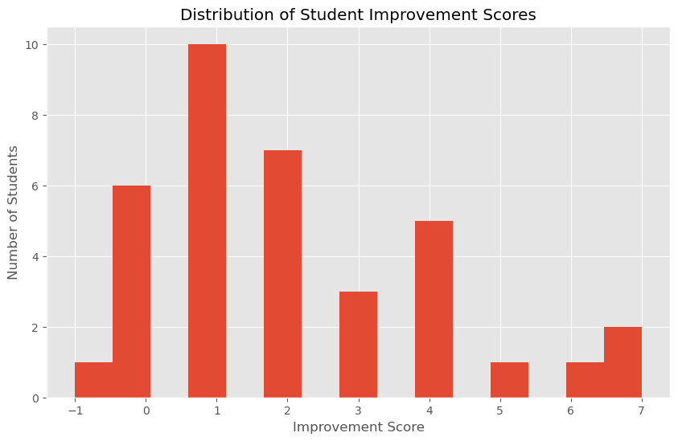
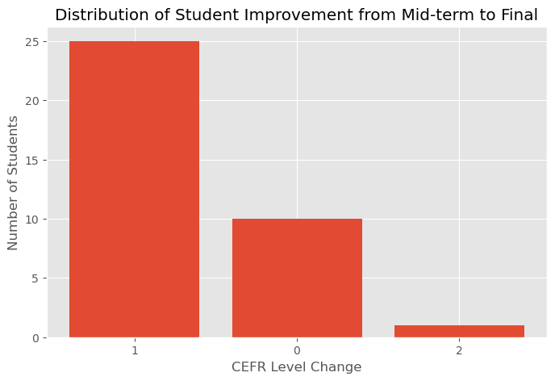
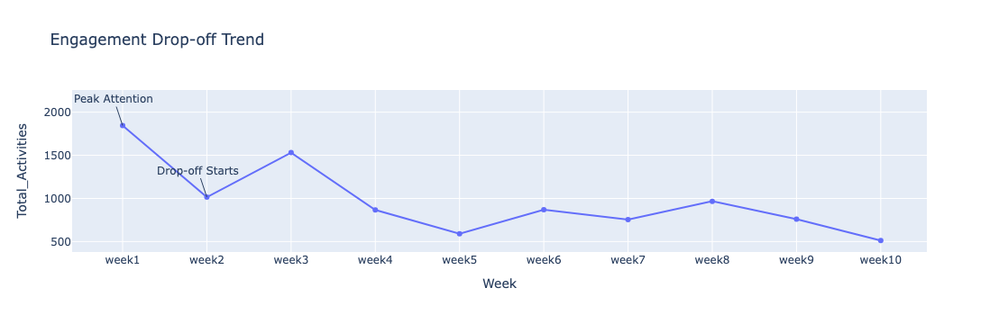

# Does Platform Activity Predict Learning? Klik2learn Engagement Analysis

**Business analytics | Learning analytics | Dashboard improvement**

An analysis of 36 adult ESOL learners at Klik2learn, a small digital-learning provider supporting migrants and refugees. Built from my MSc Business Analytics & Big Data project (University of Dundee) and an eight-week analytics internship.

## The business question

Klik2learn's automated dashboard flags learners as "Inactive" or "Consistently Active" and emails those with no recent activity. That whole system rests on one assumption: **more platform activity means more progress.**

I built those tools during my internship, then tested the assumption against assessment results.

## What I found

| | Result |
|---|---|
| Learners who improved Mid-Term to Final (points) | **29 of 36 (81%)**, average gain 2.1 points out of 12 |
| Learners who moved up a CEFR band | **26 of 36 (72%)** |
| Cohort activity over the 10 weeks | Highest in **Week 1**, fell by almost half in Week 2, partly recovered in Week 3, then sat at roughly 30% to 50% of the Week 1 level from Week 4 on |
| Link between total activity and exam outcomes | **Weak** (original analysis: r = 0.12 to 0.30, never close to 0.5). See the note below |
| Most active learners vs biggest improvers | Only **2 learners** appeared in both top-10 lists |

**Conclusion:** the learners made clear progress, but how much they did on the platform was only weakly connected to it. The status flags are useful as *usage* monitoring and should not be treated as an early-warning signal for academic risk.

> **Note on the activity numbers.** On review I found that the original activity total double-counted cumulative columns. The notebook in this repo is the corrected version. The correlation figures above come from the original analysis and are being re-run, so treat them as provisional. The assessment results (first two rows) are not affected. Details are in [docs/methodology_and_limitations.md](docs/methodology_and_limitations.md).

## Charts

[](improvement_distribution.png)





[](weekly_activity_trend.png)


## Recommendations for the dashboard

1. Relabel the status flags as **usage metrics**, not academic-risk indicators.
2. Combine activity with **assessment signals** (Mid-Term result, weakest skill) when deciding who needs support.
3. Replace the binary "Inactive" label with a **graded activity measure**.
4. Add the data that could make a predictive tool possible: tutor contact, live-session attendance, short barrier check-ins.
5. Log who receives re-engagement emails and what happens next, so the outreach can be evaluated.

Full detail, with priorities and success measures: [docs/dashboard_recommendations.md](docs/dashboard_recommendations.md)

## Repository contents

```
README.md
docs/
  business_problem.md              why this was worth analysing
  key_findings.md                  results and what they mean
  dashboard_recommendations.md     prioritised product recommendations
  methodology_and_limitations.md   data, method, corrections log, limits
  figures/                         charts (aggregate only)
notebooks/
  student_activity_performance_analysis.ipynb
data/
  README.md                        why the data is not included
```

## Method in brief

- **Data:** weekly activity counts for 5 strands over 10 weeks, plus Mid-Term and Final assessments (4 skills each, 12 points total) and CEFR levels.
- **Outcomes:** point improvement (Final minus Mid-Term) and CEFR band change, both reported because the choice changes the headline (81% vs 72%).
- **Analysis:** Pearson and Spearman correlations, a top-10 overlap check, and a cross-validated logistic regression compared against an "always improved" baseline.
- **Tools:** Python (pandas, SciPy, scikit-learn, Matplotlib). During the internship I also used SQL, Looker Studio and Google Apps Script.

## Limitations

36 learners from one cohort, no comparison group, and a correlational design, so nothing here shows *why* learners improved. A different, larger signal could appear with more data. See the methodology document for the full list.

## Running the notebook

The source data belongs to Klik2learn and is not published. To run the notebook, place a file with the same structure at `data/Weekly Breakdown Merged.xlsx` (sheet `merged_data`) and install `pandas scipy scikit-learn matplotlib openpyxl`.

## About

Oluwaseun Ayoola, MSc Business Analytics & Big Data, University of Dundee.
[LinkedIn](https://linkedin.com/in/oluwaseun-ayoola042)
